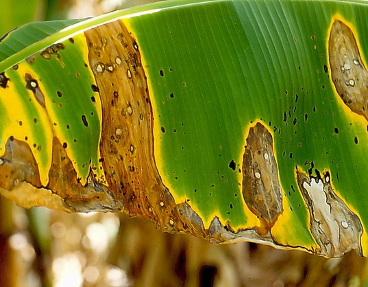
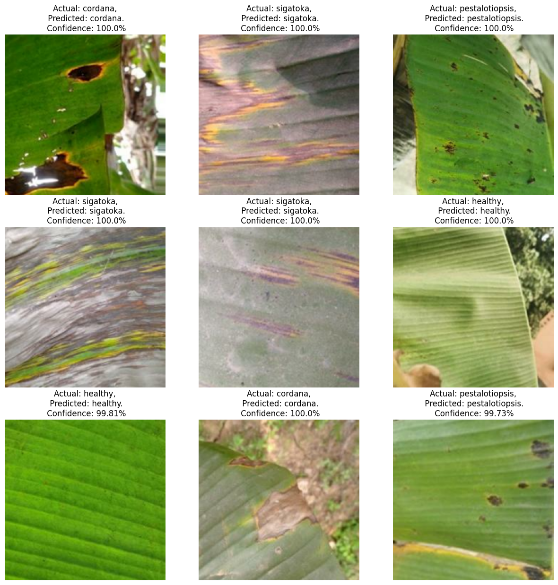
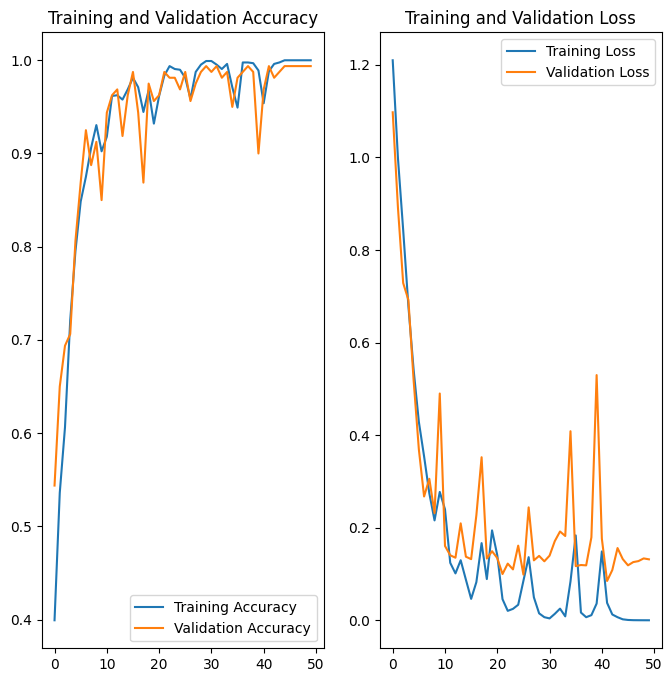

# Banana Leaf Disease Detection Using Deep Learning

<div style="display: flex; align-items: center; justify-content: center; margin-bottom: 10px;">
    
</div>

This project aims to assist farmers in detecting banana leaf diseases early by uploading an image of a diseased banana leaf. The model is based on Convolutional Neural Networks (CNN) and provides an accurate prediction of whether a banana leaf is healthy or affected by disease.

## Technologies Used

- `TensorFlow`: Deep learning framework used for model building and training.
- `NumPy`: For numerical operations and handling datasets.
- `Matplotlib`: For visualizing training metrics and data.
- `OpenDatasets`: For downloading datasets directly from Kaggle in Google Colab.

## Dataset

The dataset used in this project is from Kaggle and can be downloaded using the following link:

- [Banana Leaf Disease Detection Dataset](https://www.kaggle.com/datasets/shifatearman/bananalsd)

The dataset contains images of banana leaves, categorized into healthy and diseased classes. The data is downloaded directly to Google Colab using the `opendatasets` library.

## Model Architecture

This model uses a **Convolutional Neural Network (CNN)** for classifying banana leaf images into `healthy`, `cordana`, `pestalotiopsis` and `sigatoka` categories. CNNs are especially well-suited for image classification tasks.

## Training Details

- **Dataset Split**: 
  - 80% for training
  - 10% for validation
  - 10% for testing

- **Preprocessing**:
  - Images are resized to a fixed size `512x512`
  - Image pixel values are rescaled to the range [0, 1].

- **Data Augmentation**:
  - Random flipping and random rotation applied to increase the diversity of training data.

## Results

- **Model Accuracy**: `99.23%` on the test data.
<div style="display: flex; flex-direction: column; align-items: center; justify-content: center; margin-bottom: 10px; gap:20px;">
    
    
</div>

## Installation and Setup

To run this project, follow these steps:

1. Clone the repository:
   ```bash
   git clone https://github.com/Vathsalyatha/banana-leaf-disease-detection.git
   ```

2. Install the required dependencies:
   ```bash
   pip install tensorflow numpy matplotlib opendatasets
   ```

3. Download the dataset using the following code snippet in Google Colab:
   ```python
   import opendatasets as od
   od.download('https://www.kaggle.com/datasets/shifatearman/bananalsd')
   ```
